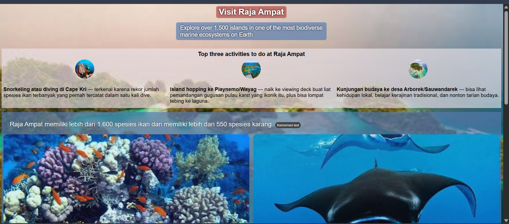
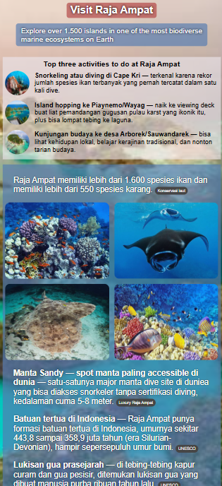
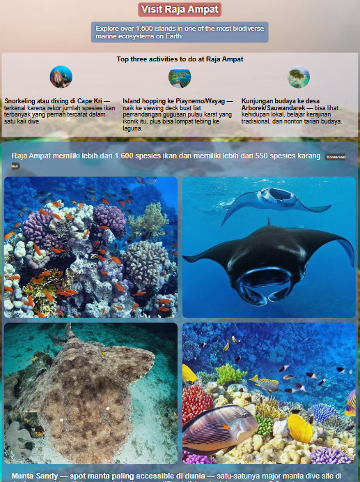

# Hometown Homepage Practice Project

A responsive one-page built as a solo practice project (HTML & CSS), showcasing Raja Ampat, Indonesia as a fictional "hometown" travel page.

## 🔗 Live Demo

[View live site](https://trydelia.github.io/raja-ampat-homepage/)

## 📸 Preview

## 🛠️ Built With

- HTML5
- CSS3

## ✨ Features

- Responsive layout (mobile-first, breakpoint at 640px)
- Top activities section with circular images and descriptive text
- All facts cited with linked sources

## 📚 Sources & Credits

- UNESCO Global Geopark - geology & rock formation data
- Universitas Indonesia (International Journal of Indonesian Law) - Sasi tradition
- Konservasi Laut Indonesia - marine species data
- Luxury Raja Ampat - Manta Sandy dive site information

Images sourced from:

- Cape Kri - https://indonesiajuara.asia/blog/pulau-kri-raja-ampat/

- Piaynemo - https://travel.kompas.com/read/2021/11/03/182340527/menengok-keindahan-piaynemo-raja-ampat-yang-kini-sepi-turis?page=all

- Arborek Island - https://pesonapapua.com/arborek-desa-wisata-yang-paling-indah-di-papua-barat/

### _Thank you_
